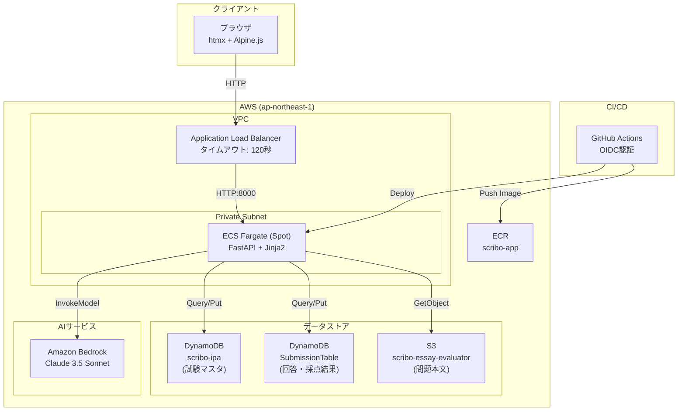
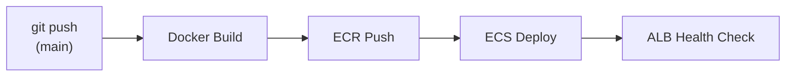

# Scribo システムアーキテクチャ

## 概要

ScriboはIPA午後Ⅱ論述式試験の学習支援アプリケーションです。  
FastAPI + htmx + Alpine.js をフロントエンド/バックエンドに採用し、AWS ECS Fargate (Spot) でホスティングしています。

---

## システム構成図



---

## コンポーネント詳細

### 1. フロントエンド

| 技術 | バージョン | 用途 |
|------|-----------|------|
| htmx | 2.0.4 | 非同期通信、部分更新 |
| Alpine.js | 3.14.3 | リアクティブUI、状態管理 |
| Tailwind CSS | CDN | ユーティリティCSS |
| DaisyUI | 4.12.14 | UIコンポーネント |

**特徴:**
- SPA不要のサーバーサイドレンダリング
- `hx-get`, `hx-post`, `hx-target` で部分更新
- `x-data`, `x-model`, `@click` でクライアントロジック

### 2. バックエンド

| 技術 | バージョン | 用途 |
|------|-----------|------|
| FastAPI | 0.115.6 | Webフレームワーク |
| Jinja2 | 3.1.4 | テンプレートエンジン |
| uvicorn | 0.32.1 | ASGIサーバー |
| boto3 | 1.35.x | AWS SDK |
| pydantic-settings | 2.6.x | 設定管理 |

**エントリーポイント:** `app/main.py`

### 3. AWS インフラ

| サービス | リソース名 | 説明 |
|----------|-----------|------|
| ECS Fargate | scribo-cluster | Spot インスタンス（コスト最適化） |
| ALB | scribo-alb | タイムアウト120秒（Bedrock対応） |
| ECR | scribo-app | Docker イメージリポジトリ |
| DynamoDB | scribo-ipa | 試験マスタデータ |
| DynamoDB | SubmissionTable | 回答・採点結果 |
| S3 | scribo-essay-evaluator | 問題本文（JSON） |
| Bedrock | Claude 3.5 Sonnet | AI採点 |

### 4. CI/CD パイプライン



| ワークフロー | トリガー | 処理内容 |
|-------------|---------|---------|
| `deploy.yml` | main push (app/**) | Docker ビルド → ECR → ECS |
| `cdk-deploy.yml` | main push (backend/lib/**) | CDK deploy |
| `initial-build.yml` | 手動 | 初回イメージビルド |

---

## データフロー

### 試験一覧取得

```
Browser → ALB → ECS (FastAPI)
                    ↓
              DynamoDB Query
              (PK = "EXAM#IS")
                    ↓
              JSON Response
```

### 問題詳細取得

```
Browser → ALB → ECS (FastAPI)
                    ↓
              DynamoDB GetItem
              (メタデータ取得)
                    ↓
              S3 GetObject
              (問題本文取得)
                    ↓
              JSON Response
```

### 採点フロー

```
Browser → ALB → ECS (FastAPI)
                    ↓
              DynamoDB GetItem
              (回答取得)
                    ↓
              Bedrock InvokeModel
              (Claude 3.5 Sonnet)
              ※ 最大90秒
                    ↓
              DynamoDB PutItem
              (採点結果保存)
                    ↓
              JSON Response
```

---

## DynamoDB スキーマ

### scribo-ipa（試験マスタ）

| 属性 | 型 | 説明 |
|------|-----|------|
| PK | String | `EXAM#{exam_type}` (例: `EXAM#IS`) |
| SK | String | `YEAR#{year}{term}#ESSAY#Q{num}` |
| title | String | 問題タイトル |
| year_term | String | 年度・期 (例: `2025春`) |
| s3_uri | String | S3の問題本文URI |

### SubmissionTable（回答・採点）

| 属性 | 型 | 説明 |
|------|-----|------|
| PK | String | `SUBMISSION#{submission_id}` |
| SK | String | `ANSWER` または `SCORE` |
| exam_type | String | 試験区分 |
| problem_id | String | 問題ID |
| answers | Map | 設問別回答 |
| aggregate_score | Number | 総合スコア (採点後) |
| final_rank | String | 最終ランク A/B/C/D |

---

## 環境変数

| 変数名 | デフォルト値 | 説明 |
|--------|-------------|------|
| AWS_REGION | ap-northeast-1 | AWSリージョン |
| DYNAMODB_EXAM_TABLE | scribo-ipa | 試験マスタテーブル |
| DYNAMODB_SUBMISSION_TABLE | SubmissionTable | 回答テーブル |
| BEDROCK_MODEL_ID | anthropic.claude-3-5-sonnet-20240620-v1:0 | Bedrockモデル |

---

## CDKスタック構成

```
backend/
├── bin/backend.ts          # CDKエントリーポイント
└── lib/
    ├── scribo-ecr-stack.ts       # ECRリポジトリ
    ├── scribo-fargate-stack.ts   # VPC, ECS, ALB, IAM
    └── scribo-github-oidc-stack.ts # GitHub OIDC認証
```

**デプロイ順序:**
1. `ScriboEcrStack` - ECRリポジトリ作成
2. `ScriboGitHubOidcStack` - GitHub Actions用IAMロール
3. `ScriboFargateStack` - VPC, ECS, ALB（ECRに依存）

---

## セキュリティ

- **認証**: なし（パブリックアクセス）
- **ネットワーク**: ECSはPrivate Subnetに配置
- **IAM**: 最小権限の原則
  - DynamoDB: Read/Write (SubmissionTable), Read (scribo-ipa)
  - S3: Read (scribo-essay-evaluator)
  - Bedrock: InvokeModel

---

## コスト最適化

| 施策 | 効果 |
|------|------|
| Fargate Spot | 最大70%のコスト削減 |
| NAT Gateway 1台 | $45/月の節約 |
| CloudWatch Logs 1週間保持 | ログストレージ削減 |
| ALB タイムアウト120秒 | Bedrock長時間処理対応 |

---

## 関連ドキュメント

- [API仕様書](./API_SPECIFICATION.md)
- [デプロイ手順](./DEPLOYMENT_GUIDE.md)
- [採点API詳細](./SCORING_API.md)
- [UXデザインガイドライン](./ux-design-guidelines.md)
